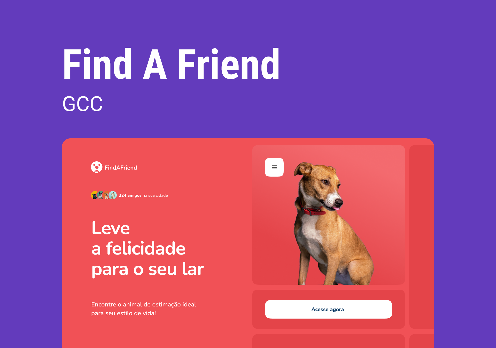

<h1 align="center"> <strong>GCC: Find A Friend</strong> </h1>

O FindAFriend é um produto desenvolvido pela Startup FindAFriend onde você pode encontrar o animal de estimação ideal para seu estilo de vida! 🐶

  <a href="#-sobre">Sobre</a>&nbsp;&nbsp;&nbsp;|&nbsp;&nbsp;&nbsp;
  <a href="#-gcc">GCC</a>&nbsp;&nbsp;&nbsp;|&nbsp;&nbsp;&nbsp;
  <a href="#-tecnologias">Tecnologias</a>&nbsp;&nbsp;&nbsp;

 

  

## 📝 Sobre

A FindAFriend acredita que todo bichinho merece uma vida confortável e segura. Por isso, cria soluções que ajudam ONGs e entidades protetoras a conectar pessoas adotantes e animais resgatados. Atualmente, a empresa recebeu um grande investimento de uma indústria de medicina animal e agora precisa evoluir seu único produto ativo - o FindAFriend, para atender às expectativas do investidor.

No FindAFriend, as ONGs cadastram os bichinhos disponíveis para adoção informando características como: porte, nível de energia, nível de independência, sociabilidade e gênero. 

## 💚 GCC

O Green Chain Challenge (GCC) é um projeto desenvolvido especialmente para a comunidade dev com desafios que simulam situações reais que um desenvolvedor vai encontrar no mercado de trabalho! 

## 🚀 Tecnologias

Esse projeto foi desenvolvido com as seguintes tecnologias:

- HTML
- CSS
- JavaScript
- GIT & GitHub
- Consumo de API

-----

Feito por: <strong>Guilherme Batista</strong>

<a 
href="https://guiogigo.github.io/GCC-Find-A-Friend-Page/">
<strong>Visite o projeto online</strong>
</a>

